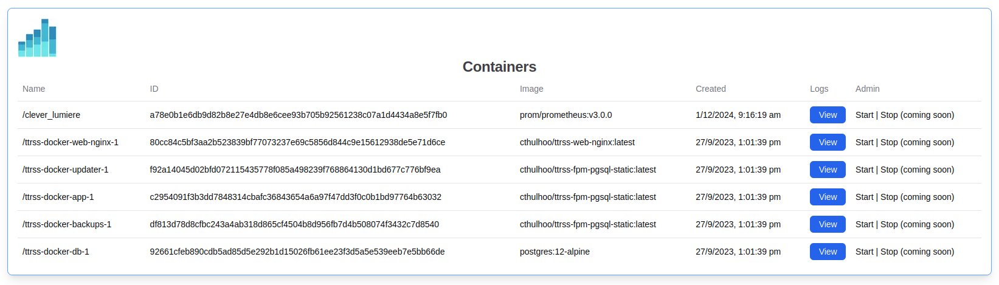
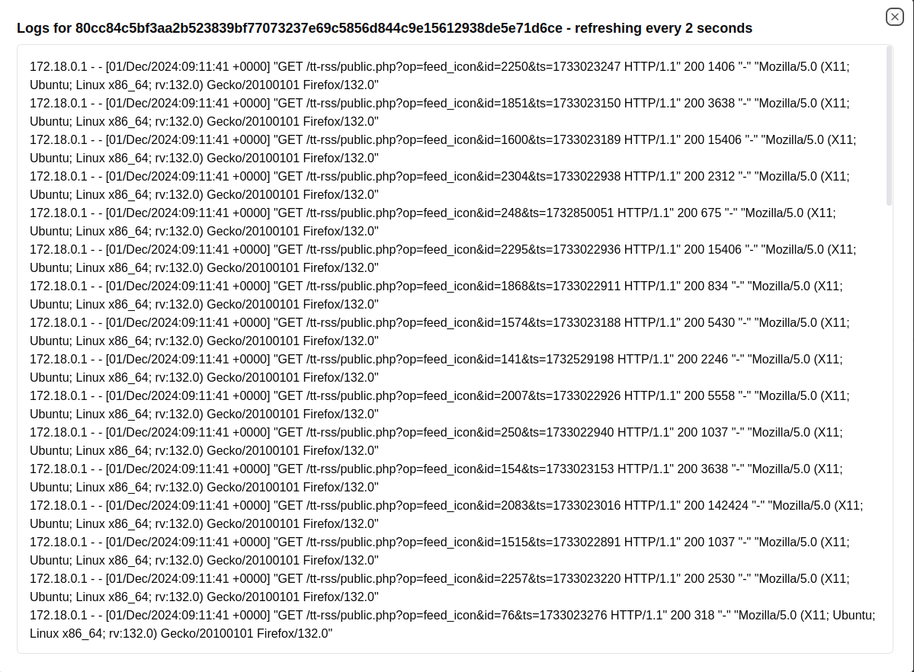

<p align="center">
  
</p>

# **constat**

## What is constat?
constat is a simple status page to list the running Docker containers on your local machine. You can run as a Next app or as a Docker container.

## Screenshots





## Getting Started

First, run the development server:

```bash
npm run dev
# or
yarn dev
# or
pnpm dev
# or
bun dev
```

Open [http://localhost:3000](http://localhost:3000) with your browser to see the result. The port might be different if you have another Next project running on 3000.

## Running in a Container
constat can itself run in a container.

It needs `/var/run/docker.sock` to be mounted inside to be able to talk to the Docker daemon on the machine where its running.

```shell
docker run -p9001:3000 -v /var/run/docker.sock:/var/run/docker.sock ghcr.io/incidenthub-cloud/constat:latest
```

Open [http://localhost:9001](http://localhost:3000) with your browser to see the result.
